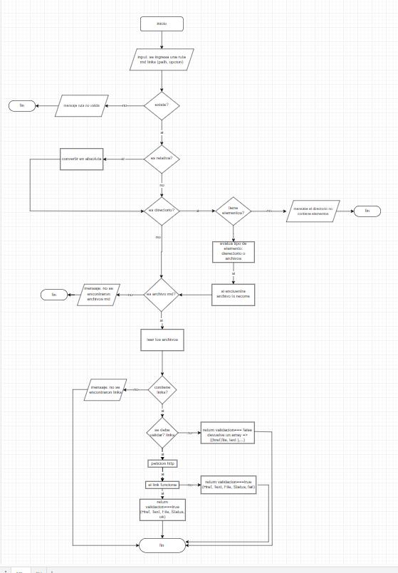
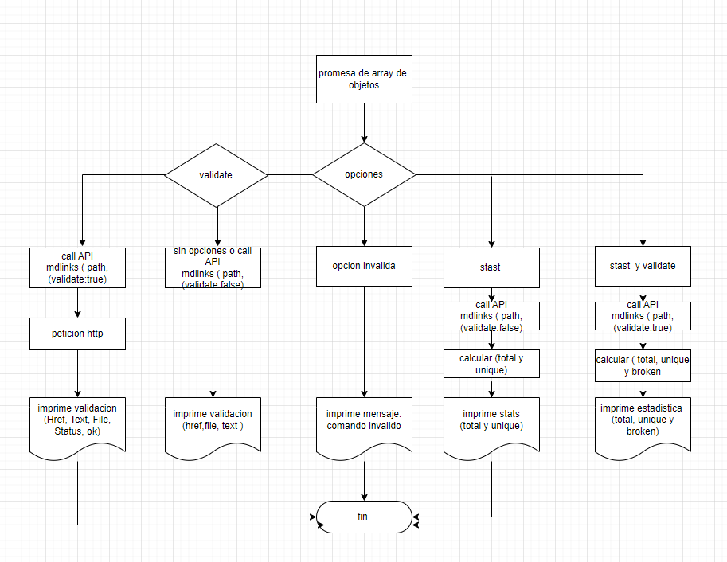
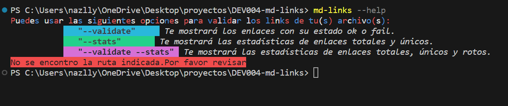
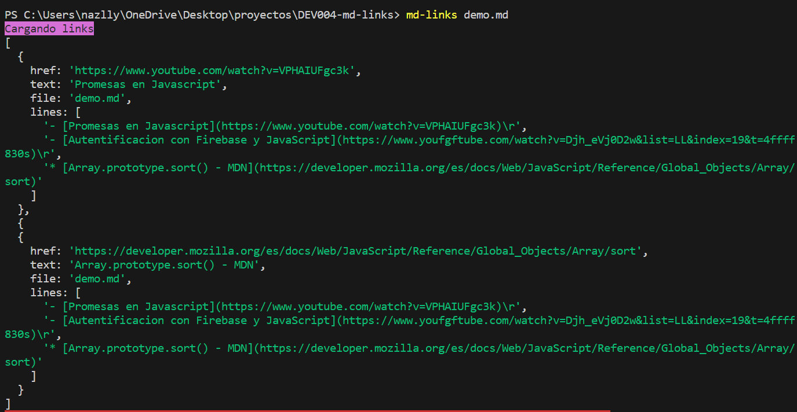
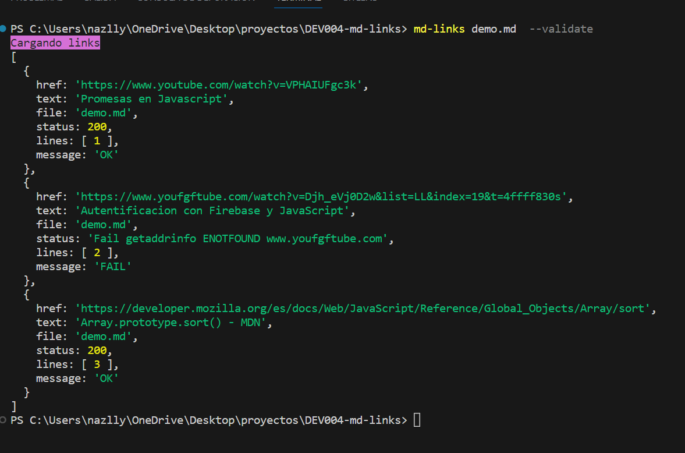
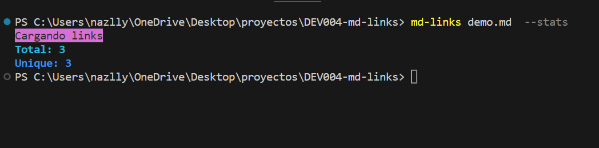
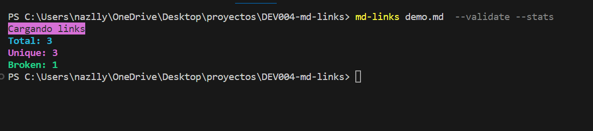
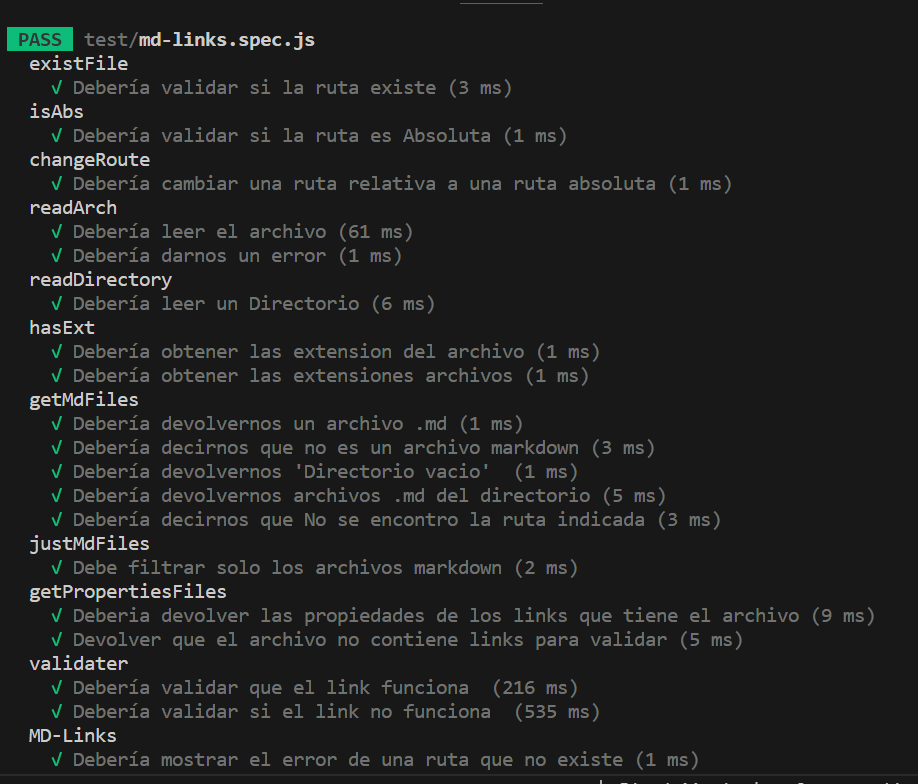
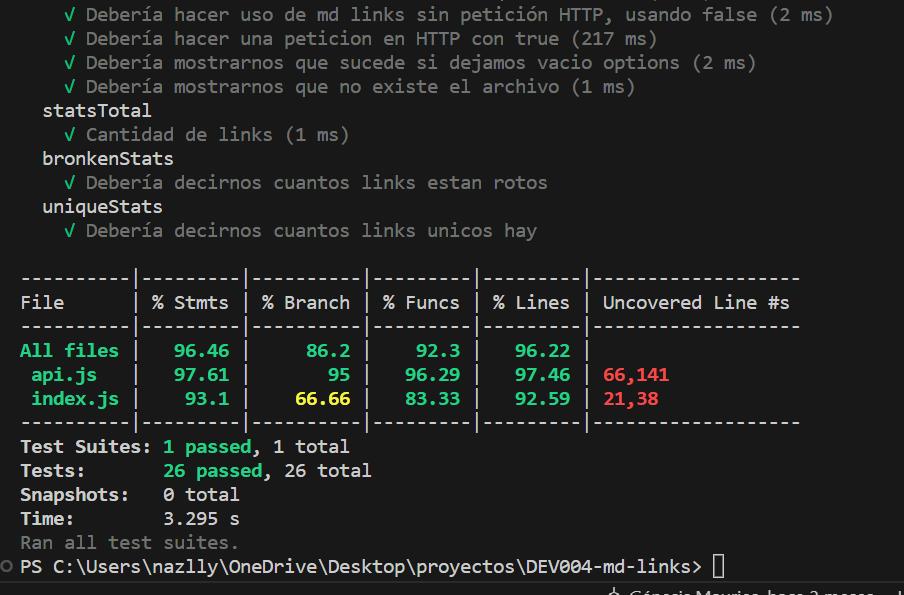

# Markdown Links
***
 ## Resumen del proyecto
de una herramienta de creación de línea de comando (CLI) así como una librería (o biblioteca - library) en JavaScript, que lea y analice archivos en formato Markdown, para verificar los enlaces que contengan y reportar algunas estadísticas.
***
## Planeación de sprints
NUEVO TESTAMENTO. No terminó durante ese sprint.

### sprint 1.
- Crear diagrama de flujo API
- Crear diagrama de flujo CLI

### Sprint 2.
- API de validaciones.
- Existe la ruta
- Es absoluta la ruta
- Convertir ruta relativa a absoluta
- Es directorio
- Leer directorio
- Es archivo .md
- Leer archivo .md
- Obtener enlaces
- Petición HTTP para estado de enlaces (NT)
- Instalaciones
- Babel
### Sprint 3.
- API de validaciones
-Petición HTTP para estado de enlaces
- Estadísticas de cálculo
- Calculo stats con estado
- Índice
- Función mdFiles (NT)
- Prueba
- Existe la ruta
- Es absoluta la ruta
- Convertir ruta relativa a absoluta
- Es directorio
- Leer directorio
- Es archivo .md
- Leer archivo .md
- Obtener enlaces
- Petición HTTP para estado de enlaces (NT)
- Estadísticas de cálculo
- Calculo stats con estado
### sprin 4.
- Índice
- Implementa recursividad en funcion mdFiles
- Función mdLinks (NT)
- Prueba
- Función mdFiles
- carrera 5.
- Índice
- Función mdLinks (NT)
- Corrección en mdLinks (NT)
- Prueba
- Función mdLinks (NT)
### sprint 5.
- Índice
- Función mdLinks
- Corrección en mdLinks
- Prueba
- Función mdLinks
- CLI
- --validar
- --estadísticas
- --validar --estadísticas
- --ayuda
- Colores con librería colors
- Instalaciones
- ESLINT
***
## Diagramas de flujo
Para la planeación de este proyecto se realizaron dos diagramas de flujo, Uno de los procesos que debe realizar la API y otro de lo que debe realizar el CLI.

link de diagrama
https://drive.google.com/file/d/1XWgA982cYY36tpXxbgz7k3sZhd6eoOi_/view?usp=sharing
***
# Módulos del proyecto

 ## api.js
En este archivo se encuentran un objeto llamado api , donde cada una de sus propiedades es una función que después se ejecuta en el index.js .

Para acceder a cada función, es necesario colocar api.funciónUtilizada , por ejemplo para la función que valida si la ruta existe o no es: api.existPath(); .

Este archivo importa fs, fsp y path de node.js, para las funciones que validan alguna parte de todo nuestro proceso. Además de axios, que es un cliente HTTP basado en promesas, y es el que hace la validación de cada uno de los enlaces.

## índice.js
Este archivo contiene dos funciones, mdFiles y mdLinks . La función mdFiles(); se trata de una función recursiva que hace las primeras validaciones de nuestra api:

Compruebe si la ruta existe o no.
Comprobar si la ruta es absoluta, pero si es relativa transformarla.
Comprobar si la ruta es directorio, y leer los archivos dentro,
Compruebe que archivos son .md y forme una matriz con cada una de las rutas.
Si hay archivos .md , regrese una matriz con todas las rutas de los archivos. Si no, devuelva el error correspondiente.

La función mdLinks(); regresa una promesa. En esta función hace lo restante de validaciones.

Lee cada uno de los archivos .md.
Busca los enlaces dentro del archivo.
Hace la petición HTTP si validar es verdadero.
La promesa se resuelve con los enlaces con o sin estado, dependiendo de si validar es verdadero o falso. Y se rechaza con un mensaje de error dependiendo del caso que corresponda.

## cli.js
Este archivo contiene las condiciones para que se ejecute la línea de comandos. Importa la función mdLinks de index.js , y dependiendo de lo que se reciba en el process.argv ejecuta mdLinks(path, true) o mdLinks(path, false) . Y si es necesario, calcule las estadísticas de los enlaces encontrados.
***
## Modo de uso
### instalacion
Se puede instalar este proyecto colocando en la terminal:

npm install nazly/DEV004-md-links

## Ejecución de comandos
El comando principal es:

#### md-links
Para visualizar las opciones de comandos se ejecuta:

md-links --help

Para visualizar los enlaces que se encuentran en el/los archivos md, se ejecuta:

md-links <ruta del archivo>
Por ejemplo:

md-links ./demo.md

Para visualizar los enlaces y sus estados (ok o fail) , se ejecuta:

md-links <ruta del archivo> --validate
Por ejemplo:

md-links ./demo.md --validate

Para visualizar las estádisticas de los enlaces, sin estado, se ejecuta:

md-links <ruta del archivo> --stats
Por ejemplo:

md-links ./demo.md --stats

Para visualizar las estádisticas de los links, con status , se ejecuta:

md-links <ruta del archivo> --validate --stats
Por ejemplo:

md-links ./demo.md --validate --stats

***
 ## Pruebas unitarias
Se realizó un total de 25 pruebas para las funciones de api.js e index.js , llegando casi a la totalidad de la cobertura.

***
## Lista de verificación

### General
- Puede instalarse a través denpm install --global <github-user>/md-links

### APImdLinks(path, opts)
- El módulo exporta una función con la interfaz (API) esperada.
- Implementa soporte para archivo individual
- Implementa soporte para directorios
- implementavalidate: true or false
### CLI
- Expone ejecutable md-linksen el camino (configurado en package.json)
- Se ejecuta sin errores / salida esperada
- implementa--validate
- implementa--stats
- Pruebas / pruebas
- Las pruebas unitarias cubren un mínimo del 70% de extractos, funciones, líneas y sucursales.
- Pruebas pasa (y linters) ( npm test)
